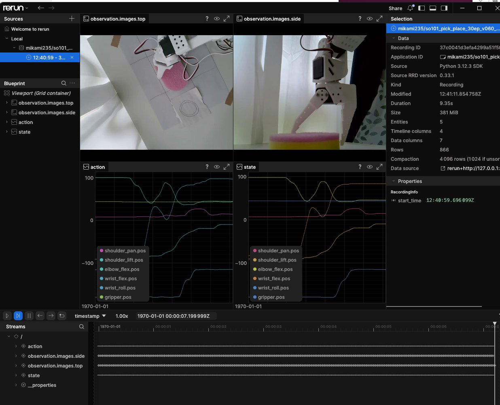

# SO-101 ACT Pick-and-Place

An imitation-learning experiment for a **LeRobot SO-101** robot arm using **ACT (Action Chunking with Transformers)** and two USB cameras.

This repository contains scripts and experiment notes for the complete workflow:

**Teleoperation → Dataset recording → Hugging Face Dataset → ACT training on a cloud GPU → Real-robot inference**

## Overview

The goal of this project is to train an SO-101 follower arm to perform a simple pick-and-place task from demonstrations collected with an SO-101 leader arm.

Two cameras are used as visual observations:

* Top camera
* Side camera

The learned ACT policy receives camera images and robot joint states and generates actions for the SO-101 follower.

```text
 SO-101 Leader
       │
       │ Teleoperation
       ▼
 SO-101 Follower
       │
       ├── Top Camera
       └── Side Camera
              │
              ▼
       LeRobot Dataset
              │
              ▼
      Hugging Face Hub
              │
              ▼
  HF Jobs / Tesla T4 GPU
              │
             ACT
              │
              ▼
   Hugging Face Model Hub
              │
              ▼
       lerobot-rollout
              │
              ▼
      SO-101 Follower
```

## Hardware

* Robot: LeRobot SO-101
* Teleoperator: SO-101 Leader
* Robot: SO-101 Follower
* Cameras: 2 × USB webcams
* Camera resolution: 640 × 480
* Camera FPS: 30
* Camera format: MJPG
* Local computer: Ubuntu PC
* Local GPU: None

The two cameras are connected through a USB hub.

USB device numbers such as `/dev/ttyACM0` and `/dev/video0` may change after reconnecting devices or rebooting the computer. Always verify them before recording or rollout.

## Software Environment

### Real Robot

* OS: Ubuntu
* Python: 3.12
* LeRobot: v0.6.0
* Package/environment manager: `uv`
* Inference device: CPU

The exact LeRobot commit and Python environment used for the experiments are stored in:

```text
environment/lerobot_version.txt
environment/pip_freeze.txt
```

### Training

Training is performed with:

* Hugging Face Jobs
* Tesla T4 GPU
* ACT policy
* `huggingface/lerobot-gpu` environment

Separating real-robot execution and GPU training allows the complete workflow to run even when the robot-control PC does not have an NVIDIA GPU.

## Why the Exact LeRobot Version Matters

LeRobot versions can differ in:

* Dataset format
* Policy configuration
* Checkpoint serialization
* Pre/post-processing
* CLI commands
* Robot and camera configuration
* Inference APIs

During this project, a policy trained with a newer LeRobot environment could not initially be loaded by an older local LeRobot environment.

The older environment raised:

```text
The fields `pretrained_revision` are not valid for ACTConfig
```

Moving the real-robot environment to LeRobot v0.6.0 resolved the configuration incompatibility and enabled the use of:

```bash
lerobot-rollout
```

For this reason, both the LeRobot release and the exact Git commit are recorded for reproducibility.

## Installation

Clone LeRobot v0.6.0:

```bash
git clone --branch v0.6.0 \
  https://github.com/huggingface/lerobot.git \
  ~/lerobot-v060

cd ~/lerobot-v060
```

Create the environment:

```bash
uv venv --python 3.12
source .venv/bin/activate
```

Install the required packages:

```bash
uv pip install -e ".[core_scripts,feetech]"
```

## Device Check

Before recording or running inference, verify the connected devices.

### Robot serial ports

```bash
ls -l /dev/ttyACM*
```

For interactive detection:

```bash
uv run lerobot-find-port
```

Stable USB identifiers can also be inspected with:

```bash
ls -l /dev/serial/by-id/
```

### Cameras

```bash
uv run lerobot-find-cameras opencv
```

Example configuration used in this experiment:

```text
Follower: /dev/ttyACM0
Leader:   /dev/ttyACM2

Top camera:  /dev/video0
Side camera: /dev/video2
```

These device numbers are **not guaranteed to remain the same**.

## Dataset Recording

Example recording configuration for 30 demonstrations:

```bash
uv run lerobot-record \
  --robot.type=so101_follower \
  --robot.port=/dev/ttyACM0 \
  --robot.id=so101_follower \
  --robot.cameras="{top: {type: opencv, index_or_path: /dev/video0, fourcc: MJPG, width: 640, height: 480, fps: 30}, side: {type: opencv, index_or_path: /dev/video2, fourcc: MJPG, width: 640, height: 480, fps: 30}}" \
  --teleop.type=so101_leader \
  --teleop.port=/dev/ttyACM2 \
  --teleop.id=so101_leader \
  --dataset.repo_id=mikami235/so101_pick_place_30ep_v060_01 \
  --dataset.num_episodes=30 \
  --dataset.episode_time_s=15 \
  --dataset.reset_time_s=10 \
  --dataset.single_task="Pick up the object and place it in the target area" \
  --display_data=true
```

The dataset produced during the experiment is:

```text
mikami235/so101_pick_place_30ep_v060_01_20260810_113739
```

## Dataset Visualization

Example:

```bash
uv run lerobot-dataset-viz \
  --repo-id mikami235/so101_pick_place_30ep_v060_01_20260810_113739 \
  --episode-index 29
```

Before training, several episodes should be visually inspected to confirm:

* Both camera streams are valid
* Pick-and-place was completed successfully
* Robot actions are recorded correctly
* There are no long unnecessary stationary periods
* No major video corruption is present

## ACT Training

The local Ubuntu PC does not have an NVIDIA GPU, so training is submitted to a Hugging Face Job using a Tesla T4.

```bash
uv run lerobot-train \
  --dataset.repo_id=mikami235/so101_pick_place_30ep_v060_01_20260810_113739 \
  --policy.type=act \
  --policy.repo_id=mikami235/act_so101_pick_place_30ep_v060_01 \
  --output_dir=outputs/train/act_so101_pick_place_30ep_v060_01 \
  --job_name=act_so101_pick_place_30ep_v060_01 \
  --policy.device=cuda \
  --batch_size=8 \
  --steps=30000 \
  --wandb.enable=false \
  --job.target=t4-small \
  --job.timeout=8h
```

The trained policy is stored on Hugging Face Hub:

```text
mikami235/act_so101_pick_place_30ep_v060_01
```

## Real-Robot Inference

The trained ACT policy can be executed on the SO-101 follower with:

```bash
uv run lerobot-rollout \
  --strategy.type=base \
  --policy.path=mikami235/act_so101_pick_place_30ep_v060_01 \
  --robot.type=so101_follower \
  --robot.port=/dev/ttyACM0 \
  --robot.id=so101_follower \
  --robot.cameras="{top: {type: opencv, index_or_path: /dev/video0, fourcc: MJPG, width: 640, height: 480, fps: 30}, side: {type: opencv, index_or_path: /dev/video2, fourcc: MJPG, width: 640, height: 480, fps: 30}}" \
  --task="Pick up the object and place it in the target area" \
  --duration=15 \
  --display_data=false
```

### CPU Inference

The local PC performs ACT inference on the CPU.

In the initial experiment, the target control frequency was 30 Hz, while the actual loop commonly operated below this rate. Occasional large inference delays were also observed.

This should be considered when evaluating real-robot behavior.

## Experiments

### Experiment 001 — 5 Episodes / 5k Steps

Dataset:

```text
mikami235/so101_pick_place_5ep_01
```

Policy:

```text
mikami235/act_so101_pick_place_5ep_01
```

Configuration:

* Demonstrations: 5
* Training steps: 5,000
* Batch size: 8
* Policy: ACT
* Training GPU: Tesla T4
* Cameras: Top + Side

Result:

* Training completed successfully
* Model was successfully loaded on the robot PC
* Real-robot ACT inference was successfully executed
* The robot mainly remained near or repeatedly approached the initial pose
* A complete pick operation was not achieved

This experiment demonstrated that the complete imitation-learning pipeline worked, but five demonstrations were insufficient for reliable task execution.

More details:

```text
experiments/001_5ep_5k.md
```

### Experiment 002 — 30 Episodes / 30k Steps

Dataset:

```text
mikami235/so101_pick_place_30ep_v060_01_20260810_113739
```

Configuration:

* Demonstrations: 30
* Training steps: 30,000
* Batch size: 8
* Policy: ACT
* Cameras: Top + Side
* Training GPU: Tesla T4

Result:

```text
TODO: Add rollout results after training.
```

More details:

```text
experiments/002_30ep_30k.md
```

## Dataset Visualization

Episode 29 visualized with LeRobot Dataset Visualizer.




## Repository Structure

```text
.
├── README.md
├── LICENSE
├── .gitignore
├── scripts/
│   ├── 00_setup.sh
│   ├── 01_check_devices.sh
│   ├── 02_record.sh
│   ├── 03_visualize.sh
│   ├── 04_train_hf_job.sh
│   └── 05_rollout.sh
├── experiments/
│   ├── 001_5ep_5k.md
│   └── 002_30ep_30k.md
└── environment/
    ├── lerobot_version.txt
    └── pip_freeze.txt
```

## Calibration

SO-101 calibration data is hardware-specific and is not included in this repository.

Each physical SO-101 should be calibrated independently before using the recording or rollout scripts.

## Safety

Real-robot policies may generate unexpected actions.

When testing a newly trained policy:

* Start with a short rollout duration
* Keep hands outside the robot workspace
* Be ready to stop the robot immediately
* Keep the initial scene close to the demonstrated distribution
* Verify camera and robot mappings before execution

## License

This project is licensed under the **Apache License 2.0**.

The project uses Hugging Face LeRobot, which is also distributed under the Apache License 2.0.

